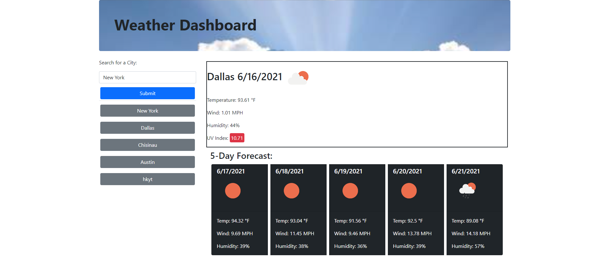

# Weather Dashboard

## Weather Dasboard built with OpenWeather API
Find out whats the current weather in any mojor city in the world just by typing in the name of the city in the searchbox. Also get a 5 day forecast with temperature, wind speed and humidity level.
Save your searches for quick access next time.
## Technologies 
* HTML5
* CSS
* JavaScript

Link to website: https://anaumov1.github.io/weather-dashboard/

## Table of contents
* [Installation](#installation)
* [Usage](#usage)
* [Credits](#credits)
* [License](#license)

## Installation

To install all the files for the "Weather Dashboard" website please clone this https://github.com/anaumov1/weather-dashboard.git repository to your computer. For instructions on how to clone a repository from GitHub follow this link: https://docs.github.com/en/github/creating-cloning-and-archiving-repositories/cloning-a-repository

## Usage

"Weather Dashboard" a simple one page website. Upon accessing the site you will see an input feild for the city search with the placeholder "New York". Input the city you need the weather information for and click search.
The information for currebt weather will display in a box on the main screen and the forcast for the next 5 days in separate boxes right bellow that. Your searches are automatically storred for future fast access, just click on the city you searched for before for current information on weather.

## Credits
The project was created to replicate a template provide by the bootcamp.

## Licence

Copyright (c) [2021] [Alexandru Naumov]

Permission is hereby granted, free of charge, to any person obtaining a copy
of this software and associated documentation files (the "Software"), to deal
in the Software without restriction, including without limitation the rights
to use, copy, modify, merge, publish, distribute, sublicense, and/or sell
copies of the Software, and to permit persons to whom the Software is
furnished to do so, subject to the following conditions:

The above copyright notice and this permission notice shall be included in all
copies or substantial portions of the Software.

THE SOFTWARE IS PROVIDED "AS IS", WITHOUT WARRANTY OF ANY KIND, EXPRESS OR
IMPLIED, INCLUDING BUT NOT LIMITED TO THE WARRANTIES OF MERCHANTABILITY,
FITNESS FOR A PARTICULAR PURPOSE AND NONINFRINGEMENT. IN NO EVENT SHALL THE
AUTHORS OR COPYRIGHT HOLDERS BE LIABLE FOR ANY CLAIM, DAMAGES OR OTHER
LIABILITY, WHETHER IN AN ACTION OF CONTRACT, TORT OR OTHERWISE, ARISING FROM,
OUT OF OR IN CONNECTION WITH THE SOFTWARE OR THE USE OR OTHER DEALINGS IN THE
SOFTWARE.
